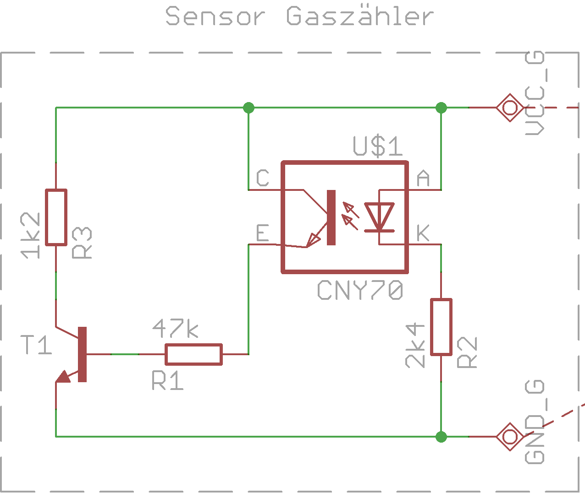
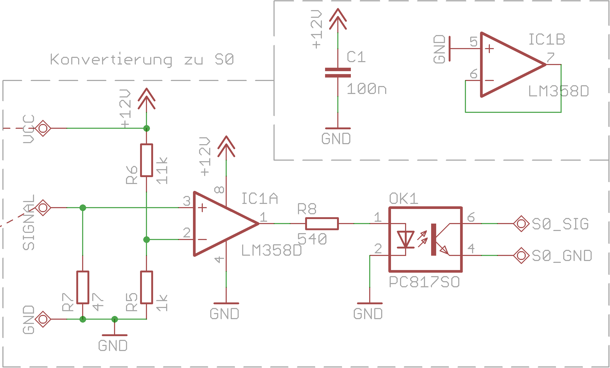
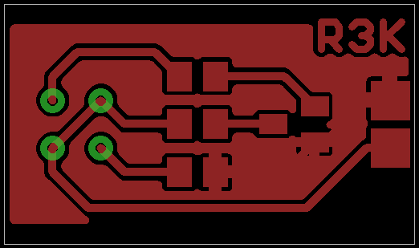
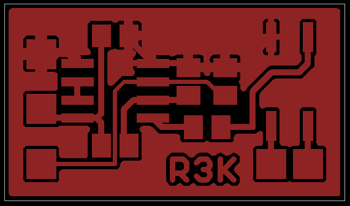

# Gaszählersensor

Dieses Projekt dient dazu, über eine Doppelader S0-Informationen von einem
Gaszähler zu erhalten.

Der Gaszähler hat in der 6 der dritten Nachkommarstelle eine reflektierende
Scheibe, was es ermöglicht, den Gasverbrauch auf jeweils 1L genau zu
messen.

Da bis zum Gaszähler nur eine Doppelader liegt, schaltet der CNY-70 über
einen Vorwiderstand einen Transistor, wodurch mehr Strom verbraucht wird.
Diese Stromdifferenz wird am anderen Ende der Doppelader dann in ein
binäres Signal übertragen und steht über einen Optokoppler potentialfrei
zur Verfügung.

## Schaltplan

### Sensor

### Konverter

## Layout

### Sensor

### Konverter

